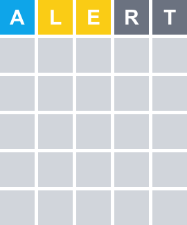

# GitHub Flash Wordle

Play Wordle directly in GitHub via issues!

### How to Play

1. Open a new issue and title it with your 5-letter guess.
2. Or comment on an existing issue with your guess.
3. The board image will update automatically after a few seconds.
